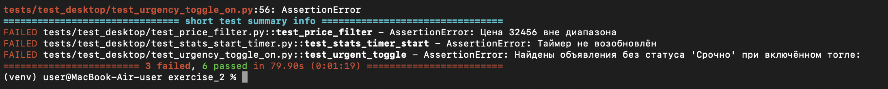
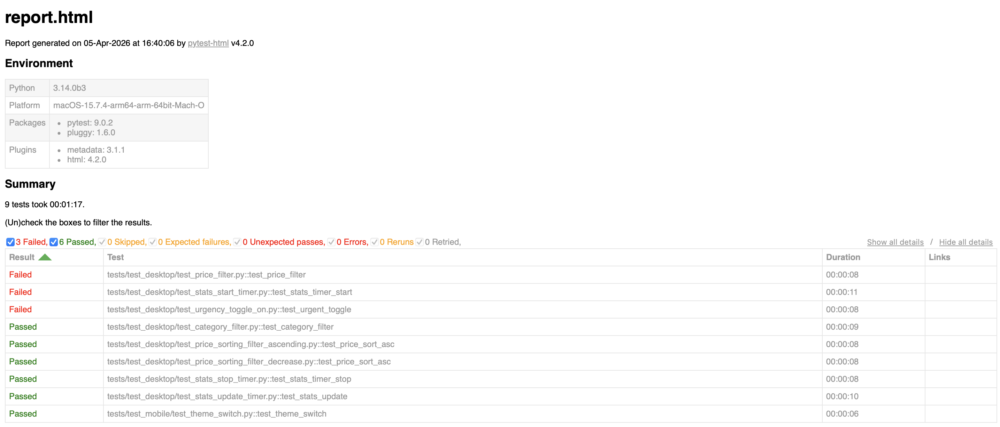

# Автотесты. Задание 2

В этой директории расположены автотесты, написанные для Задания 2.
Написано на Python + Selenium + pytest

# Структура

- `tests/`
  - `test_desktop/`
    - `test_price_filter.py`
    - `test_price_sorting_ascending.py`
    - `test_price_sorting_decrease.py`
    - `test_category_filter.py`
    - `test_urgency_toggle_on.py`
    - `test_stats_update_timer.py`
    - `test_stats_start_timer.py`
    - `test_stats_stop_timer.py`
  - `test_mobile/`
    - `test_theme_switch.py`
- `utils/`
  - `driver_utils.py`
- `requirements.txt`
- `TESTCASES.md`
- `BUGS.md`
- `README.md`
-  `.gitignore`
-  `report.html`
# Установка и запуск тестов
## Клонирование репозитория и переход в директорию
git clone https://github.com/unreso1veed/avito_test_exam

cd avito_test_exam/exercise_2
## Создание виртуального окружения
python -m venv venv

source venv/bin/activate    --  # Linux / macOS

или

venv\Scripts\activate       --  # Windows
## Установка зависимостей
pip install -r requirements.txt
## Запуск тестов
Доступно два варианта запуска тестов: 
1) С генерацией html отчета
2) Без генерации html отчета
(реализовано через pytest-html, Allure прикрутить не успел) 

Для запуска с генерацией отчета:

pytest tests/ --html=report.html --self-contained-html

Для запуска без генерации отчета: 

pytest tests/ -v

### Результат прогонки тестов
Результат прогонки тестов в консоли: 

Подробности так же выводятся в консоли выше блока саммери 

Результат прогонки тестов в отчете:

## Тестовая документация
Тестовая документация представлена .md файлами, содержащими тест-кейсы и баг-репорты, а так же отчетом о прогонке

TESTCASES.md - тест-кейсы

BUGS.md - баг-репорты

report.html - отчет о прогонке тестов 

## Примечания
- Тесты используют webdriver-manager, поэтому Chrome устанавливается автоматически
- Для мобильного теста используется эмуляция iPhone 12 Pro, изменить можно в utils/driver_utils.py
